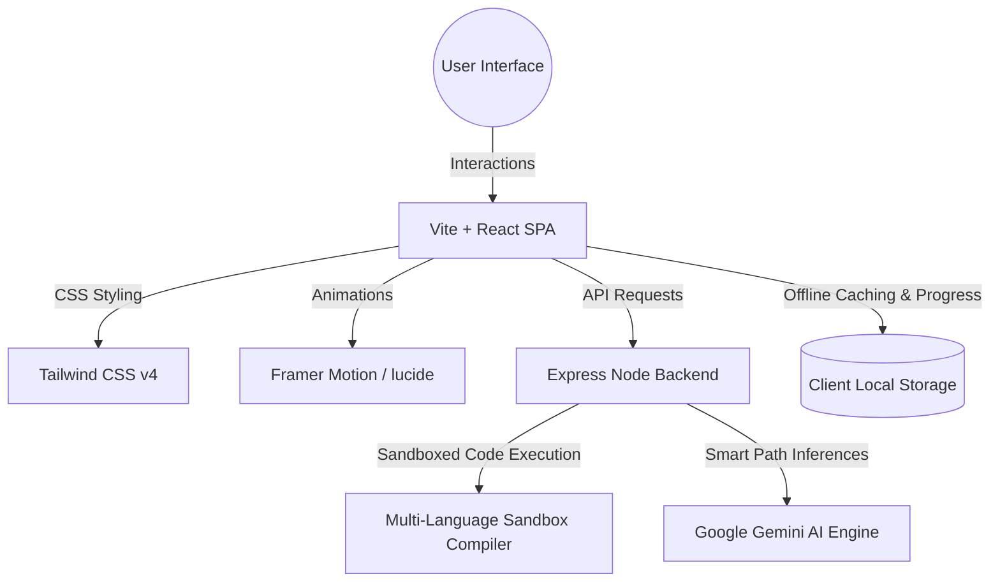

# ⏳ Time: A High-Performance 3D Academic & Technical Focus Platform

<div align="center">
  
  
  <p align="center">
    <strong>Turn micro free slots into structured learning milestones. A futuristic academic and technical study companion powered by 3D visuals, LLM smart paths, and secure sandbox code compilation.</strong>
  </p>
  
  <p align="center">
    <a href="#-key-features">Features</a> •
    <a href="#%EF%B8%8F-system-architecture">Architecture</a> •
    <a href="#-3d-visuals-engine">3D Graphics</a> •
    <a href="#%EF%B8%8F-development-setup">Setup Guide</a>
  </p>
</div>

---

## 🚀 Overview

**Time** is a premium, fully responsive React + Express single-page application built for modern students and developers. Unlike traditional static planners, **Time** dynamically restructures study slots by context-matching time parameters with custom AI-suggested milestones, gamified consistency streaks, and secure code compilation challenges.

---

## 🌟 Key Features

### 🧠 1. Domain-Specific Classrooms
- **Academic Student**: Instant interactive diagnostic quizzes covering Physics, Chemistry, Biology, and Mathematics.
- **Tech Student**: A dedicated technical coding arena featuring interactive multiple-choice questions, quantitative aptitude challenges, and robust code compilation tasks.
- **General Reader**: Summarized, debiased, and aggregated daily news briefs designed for rapid consumption.

### 💻 2. Sandbox Multi-Language Compilation Engine
- A dedicated **Express backend execution API** compiling code blocks in real-time across four core languages:
  - **JavaScript** (Node.js sandboxing)
  - **Python** (Local python3 execution)
  - **C++** (Isolated G++ execution workflow)
  - **Java** (Dynamic class-matching compiler pipeline)
- Automated unit test case validators providing instant, beautiful side-by-side terminal output and test metrics.

### 🧭 3. AI-Powered Smart Path (Google Gemini API)
- Real-time deep learning context aggregator feeding task histories, subject interests, and diagnostic logs into **Google's Gemini model**.
- Generates bespoke, micro-personalized tasks and strategic domain-specific focus pathways that adapt instantly to user progression.

### ⏱️ 4. 3D Interactive Pomodoro Sphere
- Focus state multiplier driven by a beautifully projected 3D molecular particle node mesh inside an interactive HTML5 Canvas.
- Adapts rotation velocities, glowing shadows, and connection lines dynamically based on active, study, or break states.

---

## 🎨 3D Visuals Engine

The platform incorporates a **fully custom 3D Canvas Projection Graphics Engine** running globally in the background:
- **Interactive Parallax Cam**: The background constellation camera continuously orbits slowly, matching yaw and pitch controls dynamically with user cursor coordinate shifts.
- **Dynamic 3D-to-2D Projection**: Projects active `(x, y, z)` coordinate nodes into 2D screen positions using customized field-of-view matrices.
- **Visual Constellations**: Inter-node molecular grids are linked by delicate depth-faded lines.
- **Theme Reactivity**: Automatically scales density, blending, and color palettes (`rgba` emerald and sapphire) dynamically based on light/dark mode triggers.

---

## 🛠️ System Architecture



- **Frontend Tech Stack**: React, Vite, Tailwind CSS v4, Framer Motion, Recharts, Lucide Icons.
- **Backend Tech Stack**: Express, TSX, Child Process Sandboxing.
- **Integrations**: Google Gemini API, Firebase Authentication.

---

## ⚙️ Development Setup

### Prerequisites
- **Node.js** (v18.0.0 or higher recommended)
- Optional compilers for Sandbox execution: `python3`, `g++`, `java/javac`.

### Local Installation

1. **Clone the Repository**:
   ```bash
   git clone https://github.com/your-username/time-management-platform.git
   cd time-management-platform
   ```

2. **Install Core Dependencies**:
   ```bash
   npm install
   ```

3. **Configure Environment Variables**:
   Create a `.env` file in the root directory:
   ```env
   PORT=3000
   GEMINI_API_KEY=your_google_gemini_api_key_here
   ```

4. **Launch the Development Server**:
   ```bash
   npm run dev
   ```
   *The platform will start seamlessly on **`http://localhost:3000`** with Vite hot-reloading active.*

5. **Build and Launch in Production Mode**:
   ```bash
   npm run build
   npm start
   ```

---

## 🤝 Contributing

Contributions to enhance **Time** are always welcome! Feel free to open a pull request or report issues on the GitHub tracker. 

Developed with ⏳ by [Your Name](https://github.com/your-username).
